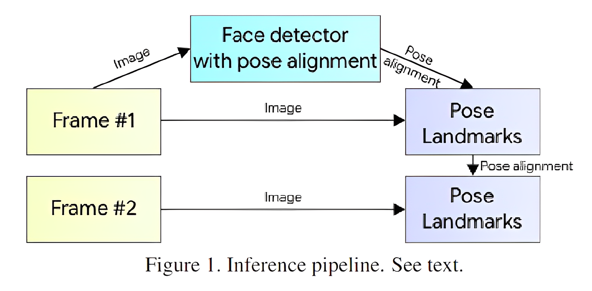
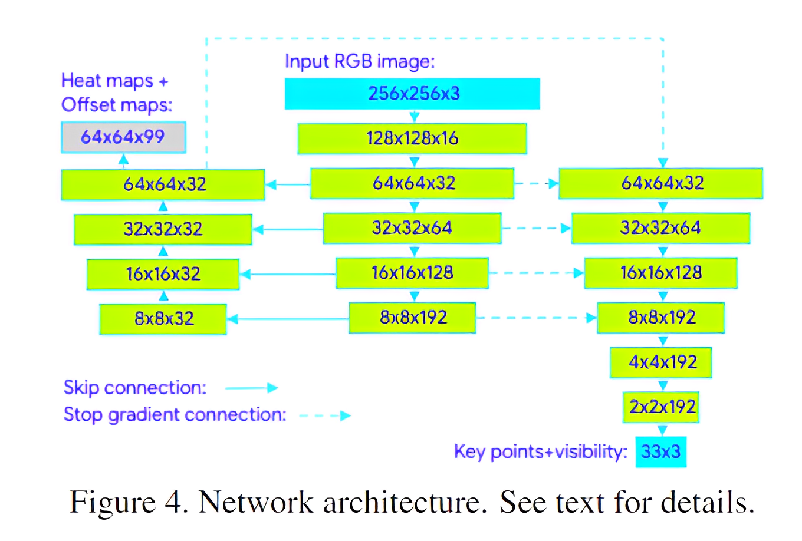
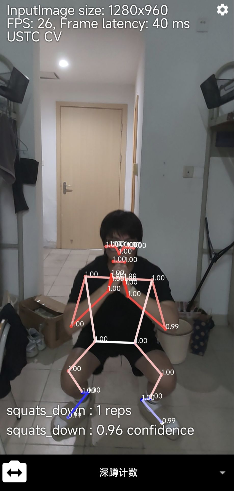
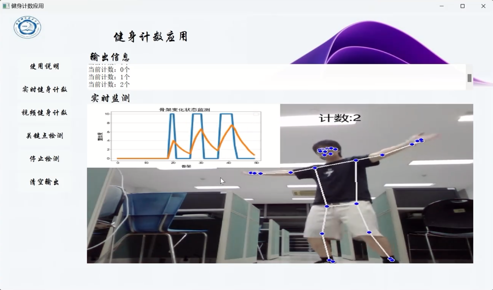

# AI-FITNESS
**项目简介**: 基于人体关键点检测的健身动作计数应用

**克隆项目:**

```bash
git clone git@github.com:ZHENGYANG-QIAN/Human-body-key-point-detection.git
```

### 人体关键点预测

本项目基于谷歌推出的人体姿态估计模型 [BlazePose: On-device Real-time Body Pose tracking](https://arxiv.org/pdf/2006.10204v1.pdf) [1], 它是一个轻量级的设备端单人关键点检测模型。其推理管道和网络结构如下。





BlazePose模型的复现工作见[models](models)

### requirements

```python
pip install opencv-python==4.7.0.72
pip install mediapipe==0.9.1.0
pip install matplotlib==3.7.1
pip install numpy==1.24.2
pip install tqdm==4.65.0
pip install pillow==9.4.0
pip install requests==2.28.2
```

### MediaPipe

MediaPipe 是 Google 推出的一款跨平台、轻量级、开放源代码的多媒体框架，旨在为开发人员和研究人员提供高效、易用、可靠的媒体处理解决方案。本项目借助MediaPipe框架使用训练好的BlazePose模型，来实现人体姿态估计。

你可以点击以下链接获取更多信息：  [Pose-mediapipe](https://google.github.io/mediapipe/solutions/pose)

通过查看我的[tutorial](tutorial)，你可以快速上手人体关键点的检测。 

### 动作姿势分类
对于类似深蹲和俯卧撑这样的常见运动，一个up和一个down是一个完整的动作，我们需要训练一个分类器来识别这个时刻的姿态是up还是down。

一种常用的方法是使用 kNN 算法。你可以在[SquatCounter](tutorial/SquatCounter.ipynb)中阅读相关代码。

### 部署

#### 1.移动端

移动端部署目前完成了安卓应用的构建。（你需要在专业的 Android 开发工具 - Android Studio 中进行修改、调试和生成 APK 文件：[Download Android Studio & App Tools - Android Developers](https://developer.android.com/studio)）

本项目使用了 Google 的 Android 机器学习应用程序模板（ML Kit）：[Pose Detection | ML Kit | Google Developers](https://developers.google.com/ml-kit/vision/pose-detection)。App源码见[android](android)。



#### 2.PC

PC端部署使用了PyQt5，它是 Qt 应用程序框架在 Python 中的封装。因其支持跨平台的特点，可以同时在Linux、Windows、MacOS等多个平台运行。学习使用PyQt5：[PyQt5 · PyPI](https://pypi.org/project/PyQt5/)

应用程序源码见[client](client)。



### 引用文献

\[1\]:Bazarevsky, Valentin, et al. "Blazepose: On-device real-time body pose tracking." *arXiv preprint arXiv:2006.10204* (2020). 

#### 参考资料

 [基于BlazePose算法的机器人人体姿势识别与模仿)](https://github.com/TYZQ/graduation_project_2022) 

[Videos on Bilibili](https://www.bilibili.com/video/BV1dL4y1h7Q6?spm_id_from=333.1007.top_right_bar_window_custom_collection.content.click)

[人体姿态识别](https://blog.csdn.net/jieqiang3/article/details/122195209) 

[人体关键点的动作分类](https://blog.csdn.net/chenpy/article/details/121466383) 

[MediaPipe](https://mediapipe.dev/) 

[Pose Detection  | ML Kit  | Google Developers](https://developers.google.com/ml-kit/vision/pose-detection) 